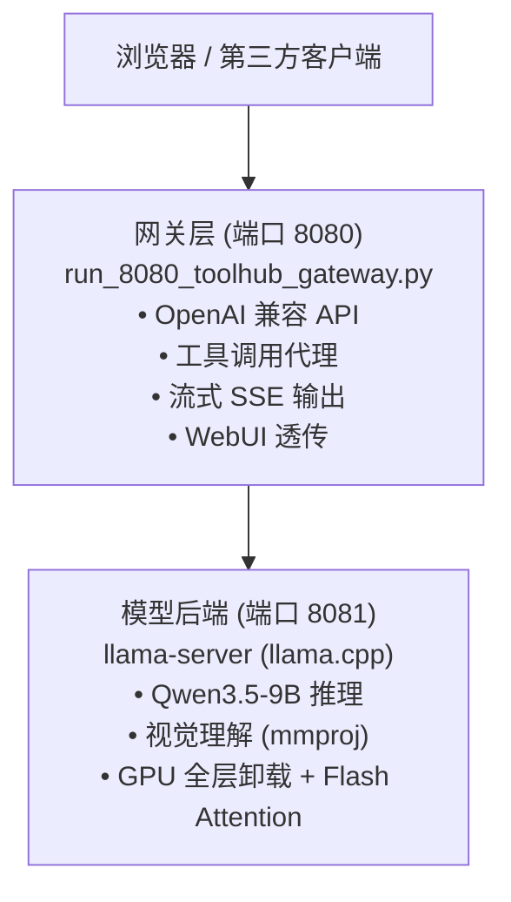

# Qwen3.5-9B ToolHub — 本地全能 AI 助手

基于 Qwen3.5-9B 多模态大模型的本地一体化部署方案。默认走 Windows 原生安装与启动流程，不需要依赖 WSL。

## 能做什么

* 联网搜索与摘要：实时搜索互联网，抓取网页正文，提炼关键信息并附来源
* 图像理解：上传图片后直接提问，支持局部放大分析细节，支持以图搜图
* 文件浏览：浏览和读取本机文件，只读，不修改你的文件
* 深度思考：内置思维链，复杂问题可展开推理过程
* 流式输出：边生成边显示，思考过程和最终回答实时呈现
* OpenAI 兼容 API：支持 `/v1/chat/completions` 接口，可对接第三方客户端

## 系统要求

| 项目 | 要求 |
| --- | --- |
| 操作系统 | Windows 10 / 11 |
| GPU | NVIDIA 显卡，驱动版本 >= 525，建议 6GB 以上显存 |
| Python | 3.10 及以上，已加入 PATH |
| PowerShell | Windows PowerShell 5.1 或 PowerShell 7 |
| 磁盘 | 至少 20GB 可用空间 |

> Q4_K_M 量化下 9B 模型约占 5.5GB 显存，加上 mmproj 视觉投影约 6.1GB。8GB 显存可正常运行。

## 快速开始

### 1. 安装

推荐方式：双击 `bootstrap.bat`。

也可以手动执行：

```powershell
.\install.ps1
```

安装脚本会自动完成：

* 创建 Python 虚拟环境并安装依赖
* 下载 llama.cpp CUDA 运行时 `llama-server.exe`
* 下载 Qwen3.5-9B Q4_K_M 主模型与 mmproj 视觉投影模型

### 2. 启动服务

```powershell
.\start_8080_toolhub_stack.ps1 start
```

首次启动需要 30 到 60 秒加载模型到 GPU。看到 栈已启动 表示就绪。

### 3. 打开网页

浏览器访问 [http://127.0.0.1:8080](http://127.0.0.1:8080)

### 4. 停止服务

```powershell
.\start_8080_toolhub_stack.ps1 stop
```

## 服务管理

```powershell
.\start_8080_toolhub_stack.ps1 start
.\start_8080_toolhub_stack.ps1 stop
.\start_8080_toolhub_stack.ps1 restart
.\start_8080_toolhub_stack.ps1 status
.\start_8080_toolhub_stack.ps1 logs
```

## 架构概览



## 内置工具

| 工具 | 说明 |
| --- | --- |
| `web_search` | 互联网搜索 |
| `web_fetch` | 抓取网页正文内容 |
| `web_extractor` | 提取网页结构化信息 |
| `image_search` | 按关键词搜索图片 |
| `image_zoom_in_tool` | 对图片指定区域放大查看 |
| `filesystem` | 浏览和读取本机文件，只读 |
| `read_memory` | 读取已保存记忆 |

> 网关模式下文件系统为只读，不提供系统命令执行与代码执行能力。

## 配置说明

复制 `.env.example` 为 `.env`，按需修改：

```bash
# 端口
GATEWAY_PORT=8080
BACKEND_PORT=8081

# 推理参数
THINK_MODE=think-on
CTX_SIZE=16384
IMAGE_MIN_TOKENS=256
IMAGE_MAX_TOKENS=1024
MMPROJ_OFFLOAD=off
```

### 思考模式切换

```powershell
$env:THINK_MODE = 'think-on';  .\start_8080_toolhub_stack.ps1 restart
$env:THINK_MODE = 'think-off'; .\start_8080_toolhub_stack.ps1 restart
```

## API 使用

```bash
curl http://127.0.0.1:8080/v1/chat/completions \
  -H "Content-Type: application/json" \
  -d '{
    "model": "Qwen3.5-9B-Q4_K_M",
    "stream": true,
    "messages": [
      {"role": "user", "content": "今天有什么科技新闻？"}
    ]
  }'
```

支持 OpenAI API 的客户端可将 Base URL 设为 `http://127.0.0.1:8080/v1`。

## 常见问题

### 页面报内容编码错误

```powershell
.\start_8080_toolhub_stack.ps1 restart
```

### 启动后模型未就绪

```powershell
.\start_8080_toolhub_stack.ps1 status
.\start_8080_toolhub_stack.ps1 logs
```

### 提示 llama-server.exe 不存在

重新执行安装脚本，确认文件存在：

` .tmp\llama_win_cuda\llama-server.exe `

### 提示模型文件不完整

检查以下文件：

* `.tmp\models\crossrepo\lmstudio-community__Qwen3.5-9B-GGUF\Qwen3.5-9B-Q4_K_M.gguf`
* `.tmp\models\crossrepo\lmstudio-community__Qwen3.5-9B-GGUF\mmproj-Qwen3.5-9B-BF16.gguf`

### 显存不足

```powershell
$env:CTX_SIZE = '8192';         .\start_8080_toolhub_stack.ps1 restart
$env:IMAGE_MAX_TOKENS = '512';  .\start_8080_toolhub_stack.ps1 restart
$env:MMPROJ_OFFLOAD = 'off';    .\start_8080_toolhub_stack.ps1 restart
```

## 兼容模式

项目仍保留 WSL 兼容入口，适合已有 WSL 用户：

```powershell
.\install.ps1 -Wsl
```

WSL 内仍可使用原脚本：

```bash
./install.sh
./start_8080_toolhub_stack.sh start
```

## 目录结构

```
.
├── bootstrap.bat                     # Windows 一键安装入口
├── install.ps1                       # 安装分发器（默认 Win，可选 WSL）
├── install.win.ps1                   # Windows 安装脚本（主流程）
├── install.sh                        # WSL 兼容安装脚本
├── start_8080_toolhub_stack.ps1      # Windows 服务启停管理（主流程）
├── switch_qwen35_webui.ps1           # Windows 模型后端控制（主流程）
├── start_8080_toolhub_stack.sh       # WSL 兼容服务启停管理
├── switch_qwen35_webui.sh            # WSL 兼容模型后端控制
├── run_8080_toolhub_gateway.py       # 网关服务
├── toolhub_gateway_agent.py          # 工具代理逻辑
├── agent_runtime/                    # 工具实现
├── requirements.txt                  # Python 依赖
├── .env.example                      # 配置模板
└── docs/                             # 补充文档
```

## 已知限制

* 当前交付包仅内置 9B 模型配置
* 网关模式下文件系统为只读
* 默认上下文窗口 16K

## 致谢

* [Qwen3.5](https://github.com/QwenLM/Qwen3)
* [llama.cpp](https://github.com/ggml-org/llama.cpp)
